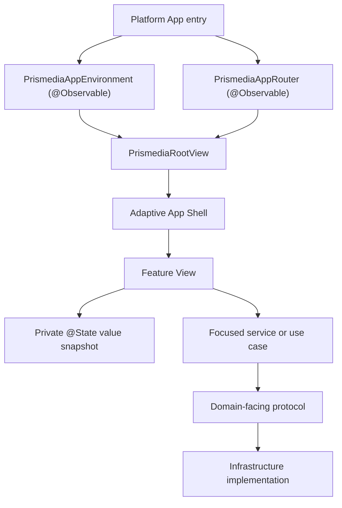

# Prismedia Native Architecture

## Goals

Prismedia has one recognizable product anatomy across Apple platforms while allowing each platform to own its navigation, density, focus, input, and media presentation. The foundation favors SwiftUI and Observation, keeps feature behavior testable without rendering, and makes platform-framework bridges explicit.

## Runtime composition



The app entries retain the environment and router with `@State`, then inject them using typed `.environment(...)`. The root decides only restoring, signed-out, and signed-in presentation. The shell owns system navigation composition; it does not own feature loading state.

## Dependency direction

Dependencies point inward:

1. `Domain` contains values and pure policy.
2. `DesignSystem` and shared `UI` contain reusable presentation primitives.
3. `Features` depend on domain values, design primitives, and narrow service protocols.
4. `Infrastructure`, `Networking`, and `Storage` implement those protocols.
5. `App` composes concrete implementations and feature screens.

Domain code never constructs HTTP requests or imports feature UI. A feature does not reach into another feature's private state. Cross-feature navigation uses typed domain links and the app router.

`EntityDetailDependencies` is assembled by App/Infrastructure and exposes detail loading, mutation, collection, reader, and video playback as independent optional ports rather than discovering capabilities by casting one loader.

The package currently exposes one `PrismediaCore` compilation target so the Swift package tests and Xcode's synchronized multi-platform app targets compile the same source tree. The vertical directories are logical modules with source-level guard tests. If physical Swift package targets are introduced, split in dependency order—Domain, Networking/Storage, DesignSystem, then Features—without making feature-to-feature imports.

## Model-View feature template

```text
Features/Example/
├── ExampleView.swift
├── Components/
├── Models/
│   └── ExampleSnapshot.swift
├── Services/
│   └── ExampleService.swift
└── Support/
```

- The feature root contains screen-level `View` entry points only.
- `Components` contains visual `View`, style, modifier, shape, and layout types.
- `Models` contains feature-owned values and presentation state.
- `Services` contains orchestration and dependency protocols.
- `Support` contains policies, formatters, extensions, and deterministic preview fixtures.
- A screen owns transient presentation state as private `@State` values.
- A snapshot is a value type with deterministic state transitions and request identity where stale responses are possible.
- A service or use case is a focused `@MainActor` struct that performs I/O through a protocol and returns values/outcomes.
- A narrow `@Observable` reference is appropriate only for shared mutable lifetime state such as the app environment, router, playback controller, tvOS focus coordinator, or decoded reader cache.
- `@Bindable` appears only where a child genuinely needs a binding into an observable reference.
- Component views take values and actions. They do not discover network clients or mutate global state.

`ModernArchitectureGuardTests` protects this contract by rejecting ViewModels, Combine-style SwiftUI ownership wrappers, manual environment keys, and UIKit/AppKit imports in App, Features, and shared UI.

## Navigation and platform adaptation

- iPhone uses system tabs with a semantic Search tab and a `NavigationStack` inside each destination.
- iPad and macOS use the same retained router state with `.sidebarAdaptable` presentation.
- tvOS owns a focus-first shell and a typed `TVTabFocusCoordinator`; feature content publishes focus intent without storing callbacks in environment values.
- Per-destination navigation paths remain in `PrismediaAppRouter`, so changing width or tab/sidebar presentation does not reset drill-down state.
- The entity-detail page owns inline playback: scrolling within that page does not interrupt it, leaving the page releases inline playback, and only already-active Picture in Picture may continue while the person browses elsewhere.

## Native design layers

The interface separates two planes:

- **Content:** media, lists, grids, text, cards, panels, and reading surfaces use semantic backgrounds, standard SwiftUI materials, typography, and spacing.
- **Functional layer:** system tab bars, sidebars, toolbars, search, menus, sheets, and important floating controls own Liquid Glass.

System components come first. Prismedia buttons use native clear, untinted Liquid Glass across floating and embedded placements; semantic color belongs in the label foreground, while prominent actions receive the shared subtle spectrum border beam. Other custom glass is reserved for functional controls over rich media, uses regular glass by default, and avoids glass-on-glass stacking.

`PrismediaColor` exposes semantic roles for Prismedia's intentionally fixed dark chrome. The generic content layer uses `PrismediaBackdrop`: opaque black with a static, muted spectrum derived from the app icon so system Liquid Glass has color to sample without competing with content. Artwork-led music, video, image, television, and reader surfaces retain their purpose-built backgrounds. Reader light and sepia options style document content only; surrounding app chrome remains dark.

## Platform adapters

SwiftUI has no complete native replacement for a few media capabilities. Those bridges are isolated under `Infrastructure/PlatformAdapters/Playback`:

- `AVPlayerAudioPlaybackEngine` — AVPlayer transport and audio-session activation
- `MusicRemoteCommandCoordinator` — MediaPlayer remote commands, Now Playing, and artwork
- `MusicSystemControls` — system volume and route-picking controls
- `NativeVideoSurface` — AVPlayerLayer hosting required for custom playback chrome and PiP attachment
- `VideoPictureInPictureCoordinator` — AVPictureInPictureController delegation
- `TVFullscreenPlayerController` — tvOS AVPlayerViewController transport menus and subtitles
- `VideoFullscreenOrientationRequest` — scene-aware iPhone fullscreen orientation request

Feature and shared UI files do not import UIKit or AppKit. Image loading, reader pages, and trick-play sprites use ImageIO/CGImage rather than platform image wrappers.

`PrismediaColor` is the single non-adapter exception: it bridges `UIColor`/`NSColor` semantic fill, label, and separator values into SwiftUI `Color` and owns the fixed dark background plus spectral brand roles. It creates no platform views or controllers.

## Preview contract

`PreviewShell` provides retained, in-memory instances of the app environment and router. Its API loader returns fixture entity lists and its artwork loader fails immediately into deterministic gradient placeholders. Previews do not read the network, Keychain, UserDefaults, or disk.

Every visual type keeps a direct preview beside the component. The preview must instantiate or apply that exact type, even when `PreviewShell`, `NavigationStack`, or another environment wrapper surrounds it. Important screens cover representative content and state variants. Fixed-dark and accessibility Dynamic Type previews are committed in source; reader document components may also preview light and sepia content. Use Xcode's environment overrides for Increase Contrast, Reduce Transparency, Reduce Motion, locale, and layout direction.

`PreviewCoverageTests` prevents wrapper previews from standing in for the component under test. `ModernArchitectureGuardTests` also keeps feature roots screen-only and separates `Components`, `Models`, `Services`, and `Support` so visual and nonvisual responsibilities remain discoverable.

## Validation contract

For shared architecture changes:

1. Run `swift test`, including architecture and preview coverage guards.
2. Build iOS, macOS, and tvOS schemes with signing disabled.
3. Run the iOS mock-server smoke flow after shell, authentication, search, entity-detail, or navigation changes.
4. Exercise the fixed dark appearance, a large Dynamic Type size, Reduce Motion, Reduce Transparency, Increase Contrast, VoiceOver, iPad/macOS resizing, and tvOS focus for affected surfaces. For reader changes, also verify each supported document theme without changing app chrome.
5. Profile representative media grids and custom glass animation when rendering behavior changes.

Compilation proves API integrity; it does not replace preview rendering, accessibility inspection, device focus testing, or media playback verification.
